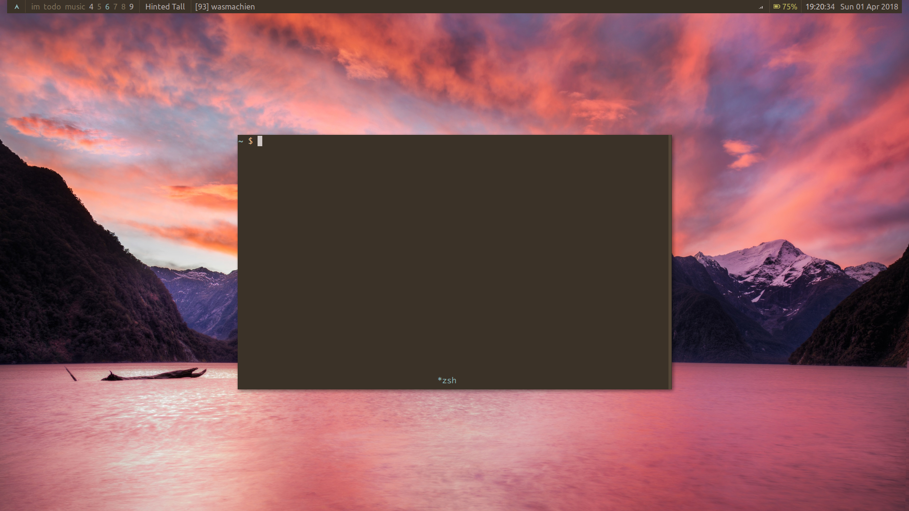
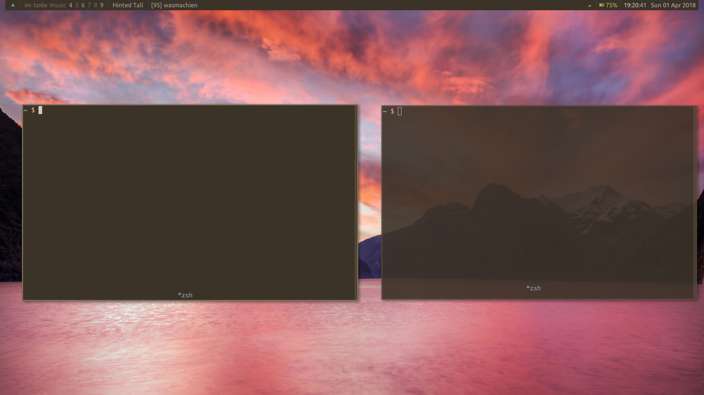
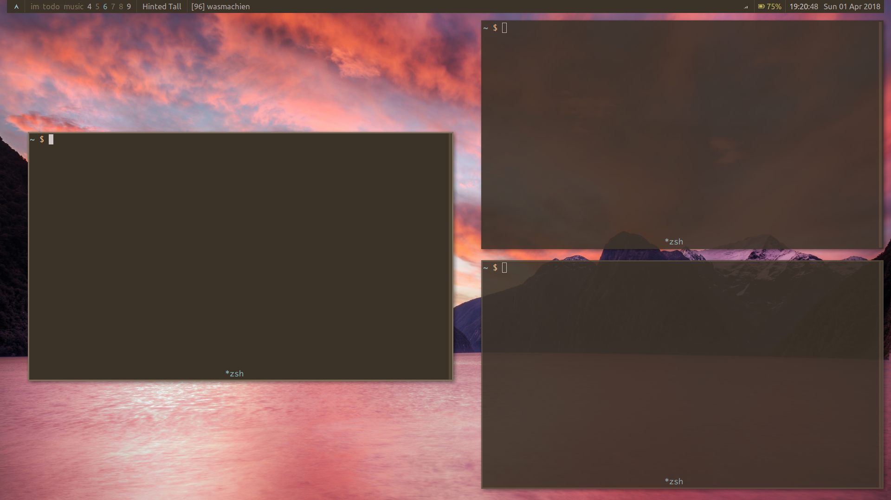

# XMonad.Layout.PseudoTiling #

This is an [XMonad](http://xmonad.org) extension that **lets windows have their
preferred size**. If you ever noticed that windows were being unnaturally
stretched, this layout modifier will fix that.

The pseudotiling layout modifier will try to set the size of windows to those
specified by the application but bounded by the space that the underlying layout
would allocate to the window. If it is smaller, the window is centered in that
space.






## Usage

### Hold my hand

Clone this repository into your `~/.xmonad/lib` directory or make it available
to you in another way.
```sh
git clone git@github.com:Procrat/xmonad-pseudotiling ~/.xmonad/lib/
```

Add the following to the imports of your `~/.xmonad/xmonad.hs`.
```haskell
import qualified XMonad.Layout.PseudoTiling     as PseudoTiling
import           XMonad.Layout.PseudoTiling     (doPseudoTile, pseudoTiling)
```

`pseudoTiling` is the name of the layout modifier where the magic happens. Add
it to your layout hook:
```haskell
layout = pseudoTiling $ tiled ||| Mirror tiled ||| Full
  where tiled = Tall 1 3/100 1/2
```

I personally like to use this in combination with the fantastic
[XMonad.Layout.LayoutHints](https://hackage.haskell.org/package/xmonad-contrib-0.13/docs/XMonad-Layout-LayoutHints.html)
module:
```haskell
layout = modifiers layouts
  where
    modifiers = layoutHintsWithPlacement (0.5, 0.5) . pseudoTiling
    layouts = tiled ||| Mirror tiled ||| Full
    tiled = Tall 1 3/100 1/2
```

This by itself won't have any effect. It allows you to pseudotile windows, but
it doesn't decide on **when** to do that. You have two options, which work
perfectly when combined as well.

#### Pseudotile new windows

To have new windows be pseudotiled automatically, add `doPseudoTile` to your
manage hook:
```haskell
manageHook :: ManageHook
manageHook = composeAll
    [ ...
    , doPseudoTile
    ]
```

You can also choose to have only certain applications pseudotiled, e.g.
```haskell
manageHook :: ManageHook
manageHook = composeAll
    [ ...
    , className =? "urxvt" --> doPseudoTile
    ]
```


#### Pseudotile on demand

To have windows only pseudotile when you explicitly ask it to, send the message
`ToggleFocusedWindow`, or, for more advanced usages, send `ToggleWindow` with a
given window.

(This example uses
[XMonad.Util.EZConfig](http://xmonad.org/xmonad-docs/xmonad-contrib/XMonad-Util-EZConfig.html)-style
key bindings, but that's not really relevant.)
```haskell
    ...
    , ("M-S-p", sendMessage PseudoTiling.ToggleFocusedWindow)
    ...
```


### Just give me the API

I think the combinations of function names and types are pretty
self-explanatory. If they are not, feel free to tell me so.
```haskell
pseudoTiling :: layout a -> ModifiedLayout PseudoTiling layout a
doPseudoTile :: ManageHook
data PseudoTilingMessage = ToggleFocusedWindow | ToggleWindow Window
```


## Acknowledgements

The idea of pseudotiling windows isn't mine but from the very fine window
manager [herbstluftwm](https://www.herbstluftwm.org/). Much appreciation goes
out to the people who came up with this idea! :heart:
